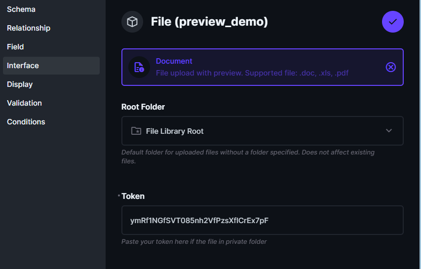

# Overview

This extension created to enable document preview on file interface.

> Please note that this extension uses the google gview engine to render the document. It will send your file to google by execute this link `https://docs.google.com/gview?embedded=true&url=https://<directus_base_url>/assets/<file_id>?<access_token>`. Moreover, it supports a wide range of documents, including pdf, doc, docx, ppt, and more.

# How to install

https://docs.directus.io/extensions/installing-extensions.html

# How to use it

### Add environment variable

```
CONTENT_SECURITY_POLICY_directives__child-src="'self' blob: https://docs.google.com/gview"
```

### Change your field interface type and configure



If your file placed on private folder you need to add a static token to it. **It is recommended to create new user with role that only have access to specific folder and generate the static token**.

# Demo


